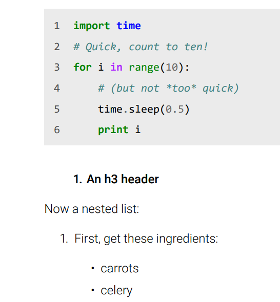

# Printdown (WIP)

Printdown is a combination of several tools allowing the conversion of Markdown files into PDF. This script relies on Pandoc and Xelatex to produce a simple and modern PDF layout.



## Features

While still in development, this tool supports most the Markdown features such as blockquotes, code, figures (images), footnotes, etc.
Some features (eg tables) might work but can look odd with the rest of the layout.

## Setup

### Windows

First you will need the further programs :

- **pandoc**: Used for the Markdown to Latex conversion.
- **xelatex**: Used to process the temporary Latex file into the final PDF.
- **python** and **pip**: Used to power Pygments the syntax highlighter.

You must install Pygments using pip.

```shell
pip install Pygments
```

### Other systems

As for now, the batch script only works on Windows.
However, because Printdown script relies exclusively on multi-platform programs, it should work on Linux and Mac OS X.
I will surely adapt this Windows `.bat` to a Linux `.sh` to allow this tool to be used on servers for instance.

## How to use

You need to place your Markdown files in the input directory.

> If your Markdown contains relative links to images, you must manage the fact that the conversion will occur in a `tmp\` folder, sibling to the `input\` folder.
> Thus you may need to copy an assets folder from `input\` into `tmp\` before any other process. See the batch file for further details...

Just call the script :

```shell
convert.bat
```

Each Markdown file outputs 2 files :
- the intermediate Latex file
- the computed PDF file

### Unicode

Unicode support can be archived with [emojione for Latex](https://github.com/benjamin-weiss/emojione-latex).

## ToDo

- [ ] Tables style, rules style, ...
- [ ] Batch file for other OS
- [ ] Better assets handling
- [ ] Better documentation
- [ ] Many more ...
